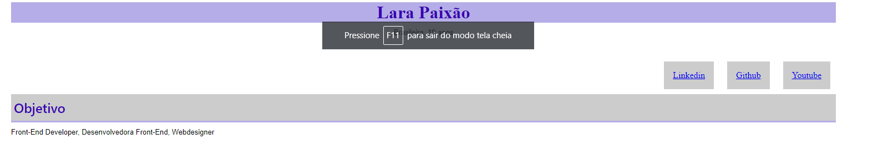

# Currículo 2 com menu interativo
> O mesmo modelo do currículo 2 porém com um pequeno menu interativo que permite quem estiver interessado entrar nas redes sociais profissionais do candidato.

## Exemplo de uso

Bom para que o contratante tenha acesso rápido as redes sociais mais utilizadas pelos dev's para apresentarem seus projetos e trabalhos e observem suas habilidades e desenvolvimento.

## Meta

Seu nome - [Linkedin](www.linkedin.com/in/larapaixao) - lara.paixao.nascimento@gmail.com

[Github](https://github.com/LPaixao18)
